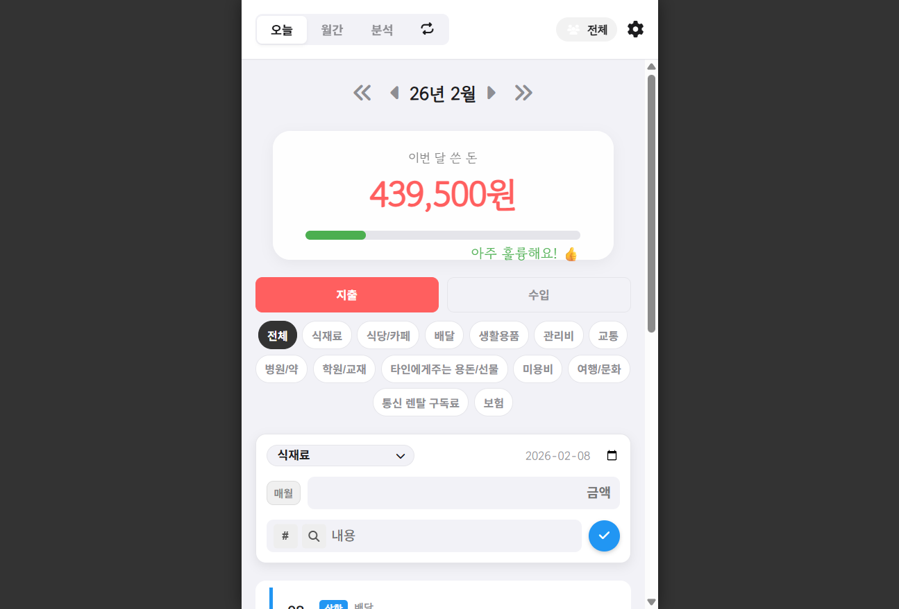
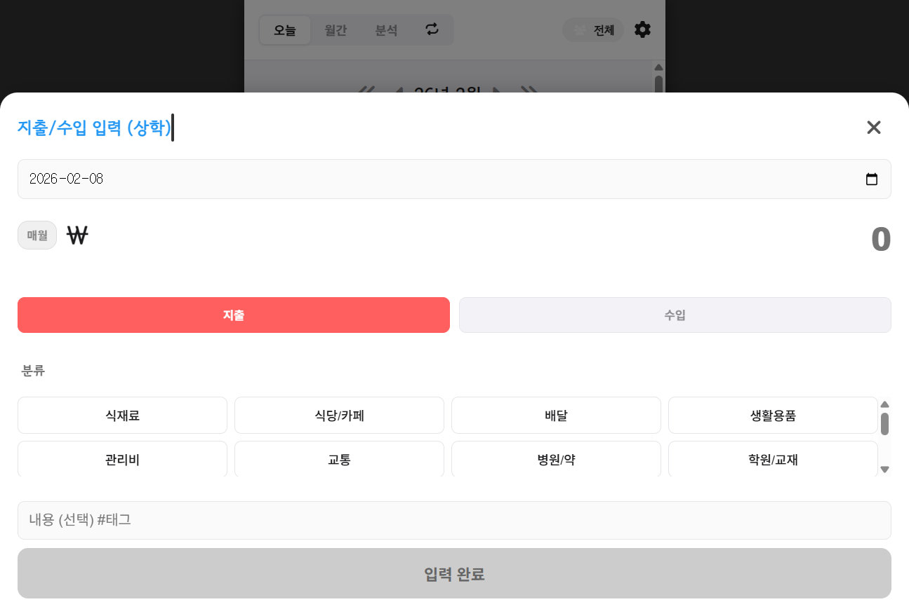
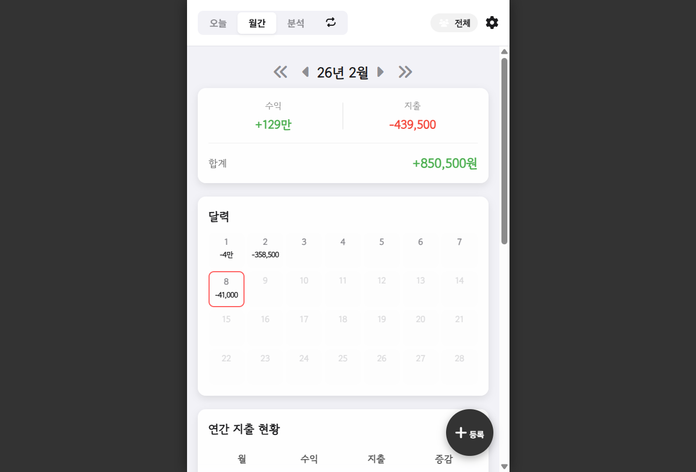
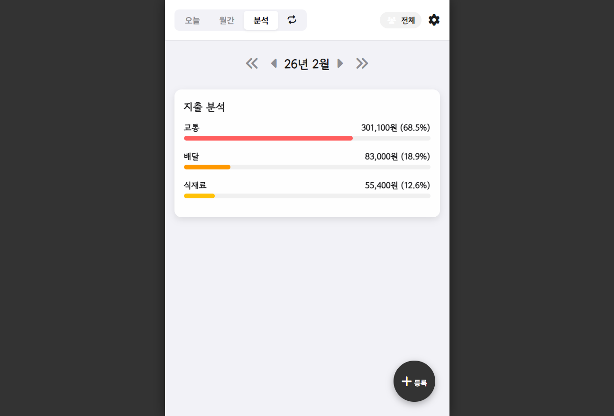
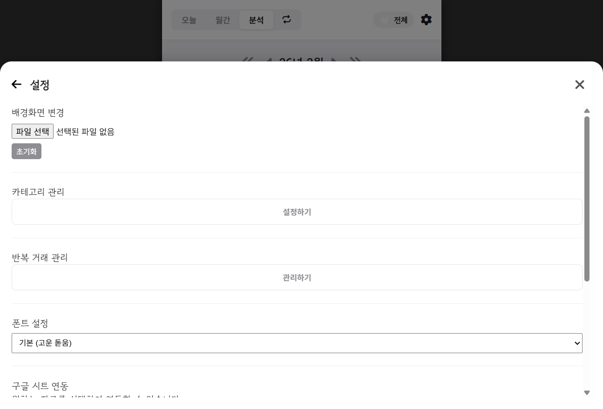

# 💰 심플머니 (QuickMoney) 사용자 가이드

**심플머니**는 직관적인 디자인과 강력한 기능을 갖춘 가계부 애플리케이션입니다. 본 가이드는 앱의 주요 기능과 사용법을 상세히 설명합니다.

---

## 1. 🏠 대시보드 (오늘)

앱을 실행하면 가장 먼저 만나는 홈 화면입니다. 현재의 재정 상태를 한눈에 파악할 수 있습니다.

### 주요 기능

- **이번 달 쓴 돈**: 화면 중앙에 붉은색 숫자로 이번 달 총 지출액을 표시합니다.
- **예산 바 (Budget Bar)**: 지출액 아래 초록색 바는 예산 대비 지출 현황을 시각적으로 보여줍니다. 바가 꽉 차지 않도록 주의하세요!
<!-- DISPLAY: BUDGET_BAR -->
- **상단 탭**:
  - `오늘`: 현재 대시보드 화면
  - `월간`: 달력 및 연간 흐름 확인
  - `분석`: 카테고리별 지출 분석
  - **`반복(🔄)`**: 고정 지출 관리 탭으로 이동 (새로운 아이콘 추가됨)
- **필터 및 리스트**:
  - `지출` / `수입` 버튼으로 내역을 필터링합니다.
  - 하단에는 선택한 날짜의 상세 내역이 리스트로 표시됩니다.

> [!TIP]
> **사용자 전환 기능**: 상단 우측의 **사용자 아이콘(👨‍💼/👩)**을 클릭하면 `남편(상학)` / `아내(다정)` / `전체` 모드로 전환하여 개인별 지출을 따로 관리할 수 있습니다.

---

## 2. 📝 간편 입력

지출이나 수입이 발생했을 때 즉시 기록하세요. 복잡한 절차 없이 빠르게 입력할 수 있습니다.



### 입력 방법
1. **사용자 선택**: 입력 모달 상단의 스위치로 `상학` 또는 `다정`을 선택합니다. (기본값 설정 가능)
2. **날짜 선택**: 기본적으로 오늘 날짜가 선택되어 있습니다. 필요시 변경하세요.
3. **금액 입력**: 지출할 금액을 입력합니다.
   - **매월 버튼**: 금액 입력란 옆의 `매월` 버튼을 누르면 해당 내역이 매달 자동으로 등록되는 **고정 지출**로 설정됩니다.
4. **분류(카테고리) 선택**: 식비, 교통, 쇼핑 등 아이콘을 선택합니다.
5. **내용 및 태그**: 간단한 메모를 남기세요. `#태그`를 입력하면 나중에 검색하기 쉽습니다. (예: `#점심 #강남역`)
6. **저장**: 우측 하단의 `입력 완료` 버튼을 누르면 저장이 완료됩니다.

---

## 3. 📅 월간 현황 (달력)

이번 달의 자금 흐름을 달력 형태로 확인합니다.



### 특징
- **달력 스탬프**: 지출이 없는 날은 칭찬 스탬프(Good Work!)가 찍혀 절약 의지를 높여줍니다.
<!-- DISPLAY: CALENDAR_GRID -->
- **일별 요약**: 날짜별로 작은 글씨로 총 지출액이 표시됩니다.
- **연간 리스트**: 달력 아래로 스크롤하면 1월부터 12월까지의 수입/지출/합계 추이를 표 형태로 볼 수 있습니다.
- **엑셀 내보내기**: 하단의 `엑셀로 저장` 버튼을 통해 데이터를 파일로 백업할 수 있습니다.

---

## 4. 📊 지출 분석

"돈이 다 어디로 갔지?" 궁금할 때 확인하세요.



### 분석 차트
- **카테고리별 비중**: 식비, 쇼핑, 주거비 등 어떤 항목에 돈을 가장 많이 썼는지 파이 차트와 리스트로 보여줍니다. (PDF 생성 시 자동 차트 포함 예정)
- **전월 대비**: 지난달과 비교하여 지출이 늘었는지 줄었는지 알려줍니다.

```python-chart
# 이 블록은 PDF 변환 스크립트에서 실제 파이 차트로 렌더링됩니다.
# 데이터 예시
"식비": 45
"카페/간식": 15
"교통": 20
"쇼핑": 10
"기타": 10
```

---

## 5. ⚙️ 설정 및 관리

앱을 나에게 딱 맞게 커스터마이징하세요. (우측 상단 톱니바퀴 아이콘)



- **배경화면 변경**: 좋아하는 사진을 넣어 심플머니를 나만의 분위기로 꾸밀 수 있습니다.
- **카테고리 관리**: 소비 패턴에 맞춰 카테고리를 자유롭게 추가하거나 삭제할 수 있습니다.
- **반복 거래 관리**: 등록된 고정 지출 목록을 확인하고 불필요한 항목을 삭제할 수 있습니다.
- **폰트 설정**: `기본(고운 돋움)`, `시스템 폰트(고딕)`, `명조` 중 원하는 글꼴을 선택하세요.
- **데이터 관리**:
  - **구글 시트 연동**: 데이터를 구글 스프레드시트에 백업하여 안전하게 보관합니다.
  - **CSV 가져오기/내보내기**: 엑셀 호환 파일로 데이터를 주고받을 수 있습니다.
  - **초기화**: `모든 데이터 삭제` 버튼은 데이터를 영구적으로 지우므로 주의하세요!

---

*QuickMoney와 함께 스마트한 소비 습관을 길러보세요!*
